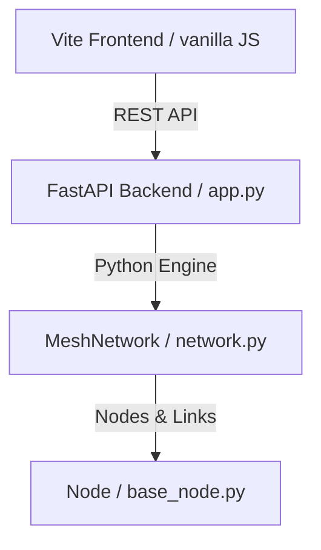

# EscapeMesh — Smart IoT Evacuation Mesh Network Simulator

EscapeMesh is a lightweight, interactive IoT routing simulation tool designed to model mesh network route discovery, convergence, and self-healing under dynamic fire emergencies in multi-floor building topologies.

---

## 🏗️ Project Architecture



### 1. Python Simulation Engine (`/escapemesh`)
* **`core/base_node.py`**: Base `Node` class containing cost/rank, active neighbors, keepalive timeout checks, and parent markers (`points_to`).
* **`core/network.py`**: Handles step-by-step tick cycles, keeps packets in flight, and loads network topology from JSON configurations.
* **`nodes/`**: Subclassed implementations of the 6 supported routing protocols.
* **`utils/logger.py`**: Colorful ANSI-formatted logging system.

### 2. FastAPI Backend (`/api`)
* **`app.py`**: Exposes endpoints (`/api/topology`, `/api/simulate`, `/api/fire`, `/api/reset`) to serve simulation history frame-by-frame. 
* Includes a **dynamic coordinates generator** that layout node IDs (`H1`-`H20`, branch paths, stairs) horizontally on an architectural corridor blueprint grid.

### 3. SVG Frontend Visualization (`/fe`)
* A responsive, single-page visualizer styled with a **light green blueprints theme**.
* Features **CAD-like interactive controls** (click and drag to pan, scroll mouse wheel to zoom in/out) allowing smooth, unrestricted navigation across the building.
* Draws realistic hallway corridors, pulsing LED micro-sensors, expanding fire zones, and neon green route flow markers.

---

## ⚡ Supported Routing Protocols

1. **Gradient Field**: Calculates distance-to-exit metrics by propagating costs directly outwards from exit nodes.
2. **Link-State (LSA)**: Nodes broadcast local connectivity states to construct global topological maps and compute shortest paths.
3. **DSDV (Destination-Sequenced Distance-Vector)**: Loop-free proactive distance-vector routing using sequence numbers to prevent routing loops.
4. **AODV (Ad-Hoc On-Demand Distance Vector)**: On-demand reactive route discovery (Route Request/Reply sequences).
5. **Potential Field**: Models routing flow using artificial potential gradients attracting packets toward safety gates.
6. **RPL (IPv6 Routing Protocol for Low-Power and Lossy Networks)**: Constructs a Destination-Oriented Directed Acyclic Graph (DODAG) using DIO control messages.

---

## 🚀 How to Run the Project

### 1. Running the FastAPI Backend
Initialize your Conda virtual environment, install requirements, and start the auto-reloading server:
```powershell
# Create & Activate Conda Env
conda create -n escapemesh python=3.11 -y
conda activate escapemesh

# Install dependencies
pip install fastapi uvicorn[standard] flask-cors

# Start FastAPI (listening on Port 5000)
python -m uvicorn api.app:app --host 0.0.0.0 --port 5000 --reload
```

### 2. Running the Vite Frontend
Install Vite node modules and start the development server:
```powershell
cd fe
npm install
npx vite --host 0.0.0.0 --port 3000
```
Open **[http://localhost:3000](http://localhost:3000)** in your web browser.

---

## 🛠️ Simulation Scenarios

* **`run_basic.py`**: Runs a simple multi-node network simulation.
* **`run_complex.py`**: Executes simulation on a complex floor layout.
* **`run_extreme.py`**: Simulates the 6-floor extreme building blueprint (`topologies/topology_extreme.json`) featuring massive routing loops, dead-ends, West/Center/East stairwells, and dynamic dual-fire incidents.
