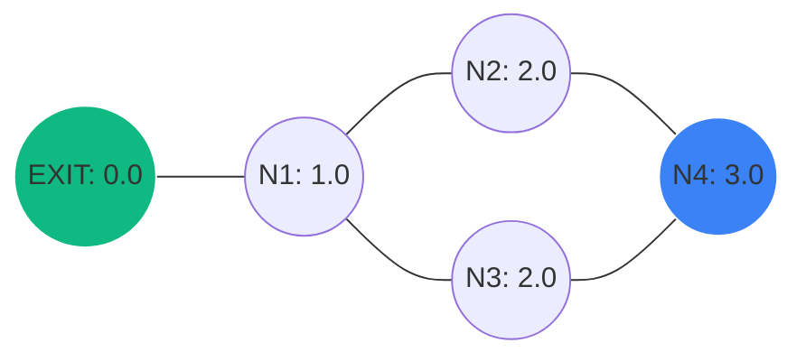
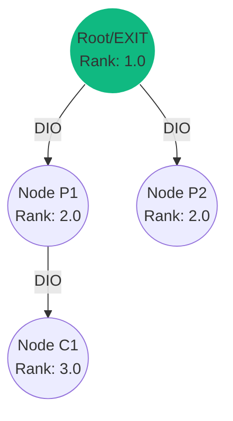

# EscapeMesh: Routing Algorithms Guide

This document explains in detail how the 6 routing algorithms in the EscapeMesh simulator operate. We use physical analogies, step-by-step logic, and ASCII/Mermaid diagrams to clarify their mechanics.

---

## 1. Gradient Field Routing (Định tuyến Trường Gradient)

### 💡 Ý tưởng cốt lõi: "Nước chảy chỗ trũng"
Hãy tưởng tượng lối thoát hiểm (`EXIT`) là một cái hố sâu nhất (độ cao = 0). Các nút khác đo khoảng cách (số hop) tới lối thoát đó để tính "độ cao" của mình. Dòng người thoát hiểm sẽ di chuyển như dòng nước, luôn chọn hàng xóm có "độ cao" thấp nhất để đi xuống.

### ⚙️ Cách hoạt động trong Code:
1. **Khởi tạo:** Nút `EXIT` tự đặt chi phí (cost) = `0.0`. Các nút khác đặt cost = `999.0` (vô cùng).
2. **Lan truyền:** Mỗi node định kỳ gửi gói tin quảng bá (heartbeat) chứa cost hiện tại của nó.
3. **Cập nhật:** Khi Node A nhận tin từ Node B có cost $C_B$, Node A tính toán chi phí nếu đi qua B: $C_{thử} = C_B + 1$. Node A sẽ chọn hàng xóm B nào cho $C_{thử}$ nhỏ nhất:
   $$\text{Cost}_A = \min (C_{\text{neighbor}} + 1)$$
4. **Khi có cháy:** Node bị cháy tự đặt cost = `999.0` (vô cực). Các nút xung quanh không nhận được heartbeat tốt từ nó nữa, phát hiện liên kết hỏng (sau 3 nhịp lỡ) và tự động cập nhật cost thông qua các hàng xóm khác để vòng qua đám cháy.

### 📊 Minh họa:

*Hướng đi của gói tin từ N4: N4 (3.0) ➔ N2 (2.0) hoặc N3 (2.0) ➔ N1 (1.0) ➔ EXIT (0.0)*

---

## 2. RPL - Routing Protocol for Low-Power and Lossy Networks

### 💡 Ý tưởng cốt lõi: "Cây phân cấp gia đình"
RPL xây dựng một cây định tuyến hướng đích gọi là **DODAG** (Destination-Oriented Directed Acyclic Graph). Nút gốc (Root/EXIT) đóng vai trò là "ông tổ". Mỗi node tính toán một giá trị gọi là **Rank** (cấp bậc). Bạn chỉ được phép chọn "cha" (Preferred Parent) có Rank nhỏ hơn mình để tránh tạo vòng lặp.

### ⚙️ Cách hoạt động trong Code:
1. **Quảng bá DIO:** Root định kỳ gửi gói tin **DIO** (DODAG Information Object) để xây dựng cây.
2. **Tính Rank:** Khi Node A nhận DIO từ Parent P:
   $$\text{Rank}_A = \text{Rank}_P + \text{RankIncrease}$$
3. **Trickle Timer:** RPL sử dụng bộ định thời Trickle. Khi mạng ổn định, tần suất gửi DIO giảm dần để tiết kiệm pin. Khi mạng biến động (ví dụ: phát hiện cháy), Trickle timer reset về giá trị nhỏ nhất để gửi DIO dồn dập, giúp mạng hội tụ nhanh.
4. **Khi có cháy:** Khi parent bị cháy, node con sẽ phát hiện mất liên lạc, reset Trickle timer để yêu cầu thông tin mới (gửi DIS) và nhanh chóng chọn một Parent khác có Rank hợp lệ.

### 📊 Minh họa:


---

## 3. AODV - Ad-hoc On-demand Distance Vector

### 💡 Ý tưởng cốt lõi: "Chỉ tìm đường khi cần"
Khác với Gradient hay RPL luôn chủ động xây dựng bảng định tuyến trước (Proactive), AODV là giao thức **phản ứng (Reactive)**. Các node nằm im lặng để tiết kiệm năng lượng. Chỉ khi nào có nhu cầu thoát hiểm, chúng mới bắt đầu đi "hỏi thăm" đường đi.

### ⚙️ Cách hoạt động trong Code:
1. **Tìm đường (RREQ):** Khi Node Source cần tìm đường tới EXIT, nó gửi broadcast gói tin **RREQ** (Route Request) lan truyền khắp mạng. Các node trung gian ghi lại "đường về" (reverse path) trỏ về phía Source.
2. **Trả lời (RREP):** Khi RREQ chạm tới EXIT, EXIT sẽ tạo gói tin **RREP** (Route Reply) và gửi unicast đi ngược lại theo reverse path để về tới Source. Các node trên đường đi sẽ thiết lập đường truyền chính thức (forward path).
3. **Báo lỗi (RERR):** Nếu một liên kết trên đường truyền bị đứt (do cháy), node phát hiện đứt sẽ gửi gói tin **RERR** (Route Error) ngược về phía Source để hủy bỏ đường truyền cũ, buộc Source phải phát RREQ mới để tìm đường vòng.

### 📊 Minh họa:
```
[Source] ===(RREQ Broadcast)===> [Node Trung Gian] ===(RREQ)===> [EXIT]
[Source] <===(RREP Unicast)====== [Node Trung Gian] <===(RREP)=== [EXIT]
```

---

## 4. DSDV - Destination-Sequenced Distance-Vector

### 💡 Ý tưởng cốt lõi: "Bảng chỉ đường có số hiệu phiên bản"
DSDV là giao thức chủ động cải tiến từ Distance Vector cổ điển. Điểm yếu lớn nhất của Distance Vector là lỗi **vòng lặp vô hạn (Count-to-Infinity)** khi đứt liên kết. DSDV giải quyết bằng cách đánh **Sequence Number** (Số hiệu tuần tự) cho mỗi tuyến đường để phân biệt đường cũ và đường mới.

### ⚙️ Cách hoạt động trong Code:
1. **Bảng định tuyến:** Mỗi node lưu trữ một bảng chứa: `[Đích, Chi phí (Hops), Next Hop, Sequence Number]`.
2. **Cập nhật:** Nút định kỳ trao đổi bảng định tuyến với hàng xóm. Khi Node A nhận được quảng bá tuyến đường từ B:
   * Nếu tuyến đường của B có **Sequence Number lớn hơn** tuyến đường A đang có ➔ A bắt buộc phải cập nhật theo B (vì đây là thông tin mới nhất).
   * Nếu **Sequence Number bằng nhau**, A chỉ cập nhật nếu tuyến qua B có **Hop Count ngắn hơn**.
3. **Khi đứt đường (Cháy):** Node phát hiện đứt đường sẽ gán cost = `INF` và **tăng Sequence Number lên số lẻ** (số lẻ biểu thị đường đã hỏng) rồi lập tức gửi cập nhật khẩn cấp (Triggered Update) để cảnh báo toàn mạng.

### 📊 Minh họa:
```
Bảng định tuyến của Node A trỏ tới EXIT:
┌───────────┬────────────┬───────────┬─────────────────┐
│ Destination│ Hop Count  │ Next Hop  │ Sequence Number │
├───────────┼────────────┼───────────┼─────────────────┤
│   EXIT    │     3      │  Node B   │       102       │ <-- Số chẵn: Hợp lệ
└───────────┴────────────┴───────────┴─────────────────┘
Nếu đứt đường, Sequence Number chuyển thành 103 (Số lẻ) ➔ Toàn mạng hủy bỏ đường này.
```

---

## 5. Link-State Routing (Định tuyến Trạng thái Liên kết)

### 💡 Ý tưởng cốt lõi: "Mỗi người giữ một bản đồ thành phố"
Thay vì chỉ tin tưởng hàng xóm chỉ đường, mỗi node chạy Link-State sẽ tự xây dựng một **bản đồ topo đầy đủ của toàn mạng** trong bộ nhớ. Sau đó, nó tự chạy thuật toán **Dijkstra** để tìm ra con đường ngắn nhất từ vị trí của nó tới đích.

### ⚙️ Cách hoạt động trong Code:
1. **Phát hiện láng giềng:** Mỗi node theo dõi xem mình đang kết nối trực tiếp với những ai.
2. **Lụt gói tin LSA:** Node đóng gói danh sách láng giềng vào gói tin **LSA** (Link State Advertisement) và gửi "lụt" (flooding) ra toàn mạng. Tất cả các node đều nhận được LSA của nhau.
3. **Xây dựng LSDB:** Mỗi node lưu trữ toàn bộ LSA nhận được vào một cơ sở dữ liệu **LSDB** (Link State Database). Bản chất LSDB chính là ma trận kề của đồ thị mạng.
4. **Chạy Dijkstra:** Mỗi nhịp, node lấy đồ thị từ LSDB ra, đặt mình làm gốc và chạy Dijkstra để tìm đường đi ngắn nhất tới các nút `EXIT`.
5. **Khi có cháy:** Node bị cháy không gửi LSA nữa, hoặc các node hàng xóm gửi LSA mới thông báo liên kết với node cháy đã bị hủy. Bản đồ LSDB thay đổi ➔ Dijkstra chạy lại ➔ Tìm ra đường tránh cháy lập tức.

### 📊 Minh họa:
```
Node A nhận LSA từ toàn mạng:
  * LSA_A: {kết nối với B, C}
  * LSA_B: {kết nối với A, D}
  * LSA_C: {kết nối với A, D}
  * LSA_D: {kết nối với B, C, EXIT}
➔ Node A vẽ đồ thị hình kim cương trong bộ nhớ và chạy Dijkstra.
```

---

## 6. Potential Field Routing (Định tuyến Trường Thế năng)

### 💡 Ý tưởng cốt lõi: "Lực hút nam châm & Lực đẩy của lửa"
Giao thức này áp dụng nguyên lý vật lý của điện trường/thế năng:
*   Các lối thoát hiểm `EXIT` tạo ra **lực hút** (thế năng âm lớn: ví dụ $-100$).
*   Đám cháy hoặc ngõ cụt tạo ra **lực đẩy** (thế năng dương lớn: ví dụ $+200$).
*   Dòng người/gói tin sẽ di chuyển dọc theo dốc thế năng hướng từ cao xuống thấp.

### ⚙️ Cách hoạt động trong Code:
1. **Tính thế năng:** Mỗi node có một thế năng $U$. Thiết bị EXIT có thế năng cố định rất thấp.
2. **Lan truyền:** Các node trao đổi thế năng với nhau.
3. **Ảnh hưởng của Lửa:** Khi một node bị cháy, thế năng của nó tăng vọt lên cực cao (`999.0`). Sức nóng thế năng này lan tỏa sang cả các node láng giềng xung quanh (thế năng của hàng xóm cũng bị đẩy tăng lên).
4. **Quyết định hướng đi:** Gói tin tại một node luôn chọn hàng xóm có thế năng thấp nhất. Vì vùng quanh đám cháy có thế năng rất cao, gói tin sẽ tự động bị "đẩy" ra xa đám cháy từ sớm, trước khi thực sự chạm mặt lửa.

### 📊 Minh họa:
```
      [Đám cháy: Thế năng +999] ➔ Đẩy ra xa
                 │
                 ▼
[Source] ➔ [Hàng xóm 1: Thế năng +20] ➔ [Hàng xóm 2: Thế năng -50] ➔ [EXIT: Thế năng -100]
```

---

## Bảng So sánh Tóm tắt

| Thuật toán | Loại hình | Cách thức tìm đường | Điểm mạnh trong lánh nạn | Điểm yếu |
| :--- | :--- | :--- | :--- | :--- |
| **Gradient** | Proactive | Theo độ dốc khoảng cách (hops) | Cực kỳ đơn giản, tốn rất ít CPU/Ram của chip. | Dễ bị lặp vô hạn (Count-to-Infinity) khi đứt đường. |
| **RPL** | Proactive | Xây dựng cây DODAG phân cấp | Chuẩn công nghiệp IoT, tiết kiệm năng lượng tốt (Trickle). | Thời gian tái lập cây khi root chết có thể bị chậm. |
| **AODV** | Reactive | Tìm đường theo yêu cầu (RREQ/RREP) | Tiết kiệm băng thông lúc bình thường. | Trễ khởi tạo đường đi cao, bão RREQ khi nhiều node cùng tìm đường. |
| **DSDV** | Proactive | Bảng định tuyến + Sequence Number | Tránh vòng lặp định tuyến tuyệt đối. | Overhead trao đổi bảng định tuyến lớn khi mạng rộng. |
| **Link-State** | Proactive | Flooding bản đồ + Dijkstra | Tìm đường tối ưu toàn cục rất nhanh khi topo đổi. | Tốn RAM để lưu bản đồ và CPU để chạy Dijkstra. |
| **Potential Field**| Proactive | Lực hút (Exit) + Lực đẩy (Lửa) | Chủ động tránh vùng cháy từ xa rất an toàn. | Thuật toán phức tạp, dễ kẹt ở cực tiểu cục bộ (ngõ cụt). |
# EscapeMesh: Routing Algorithms Guide

This document explains in detail how the 6 routing algorithms in the EscapeMesh simulator operate. We use physical analogies, step-by-step logic, and ASCII/Mermaid diagrams to clarify their mechanics.

---

## 1. Gradient Field Routing (Định tuyến Trường Gradient)

### 💡 Ý tưởng cốt lõi: "Nước chảy chỗ trũng"
Hãy tưởng tượng lối thoát hiểm (`EXIT`) là một cái hố sâu nhất (độ cao = 0). Các nút khác đo khoảng cách (số hop) tới lối thoát đó để tính "độ cao" của mình. Dòng người thoát hiểm sẽ di chuyển như dòng nước, luôn chọn hàng xóm có "độ cao" thấp nhất để đi xuống.

### ⚙️ Cách hoạt động trong Code:
1. **Khởi tạo:** Nút `EXIT` tự đặt chi phí (cost) = `0.0`. Các nút khác đặt cost = `999.0` (vô cùng).
2. **Lan truyền:** Mỗi node định kỳ gửi gói tin quảng bá (heartbeat) chứa cost hiện tại của nó.
3. **Cập nhật:** Khi Node A nhận tin từ Node B có cost $C_B$, Node A tính toán chi phí nếu đi qua B: $C_{thử} = C_B + 1$. Node A sẽ chọn hàng xóm B nào cho $C_{thử}$ nhỏ nhất:
   $$\text{Cost}_A = \min (C_{\text{neighbor}} + 1)$$
4. **Khi có cháy:** Node bị cháy tự đặt cost = `999.0` (vô cực). Các nút xung quanh không nhận được heartbeat tốt từ nó nữa, phát hiện liên kết hỏng (sau 3 nhịp lỡ) và tự động cập nhật cost thông qua các hàng xóm khác để vòng qua đám cháy.

### 📊 Minh họa:

*Hướng đi của gói tin từ N4: N4 (3.0) ➔ N2 (2.0) hoặc N3 (2.0) ➔ N1 (1.0) ➔ EXIT (0.0)*

---

## 2. RPL - Routing Protocol for Low-Power and Lossy Networks

### 💡 Ý tưởng cốt lõi: "Cây phân cấp gia đình"
RPL xây dựng một cây định tuyến hướng đích gọi là **DODAG** (Destination-Oriented Directed Acyclic Graph). Nút gốc (Root/EXIT) đóng vai trò là "ông tổ". Mỗi node tính toán một giá trị gọi là **Rank** (cấp bậc). Bạn chỉ được phép chọn "cha" (Preferred Parent) có Rank nhỏ hơn mình để tránh tạo vòng lặp.

### ⚙️ Cách hoạt động trong Code:
1. **Quảng bá DIO:** Root định kỳ gửi gói tin **DIO** (DODAG Information Object) để xây dựng cây.
2. **Tính Rank:** Khi Node A nhận DIO từ Parent P:
   $$\text{Rank}_A = \text{Rank}_P + \text{RankIncrease}$$
3. **Trickle Timer:** RPL sử dụng bộ định thời Trickle. Khi mạng ổn định, tần suất gửi DIO giảm dần để tiết kiệm pin. Khi mạng biến động (ví dụ: phát hiện cháy), Trickle timer reset về giá trị nhỏ nhất để gửi DIO dồn dập, giúp mạng hội tụ nhanh.
4. **Khi có cháy:** Khi parent bị cháy, node con sẽ phát hiện mất liên lạc, reset Trickle timer để yêu cầu thông tin mới (gửi DIS) và nhanh chóng chọn một Parent khác có Rank hợp lệ.

### 📊 Minh họa:


---

## 3. AODV - Ad-hoc On-demand Distance Vector

### 💡 Ý tưởng cốt lõi: "Chỉ tìm đường khi cần"
Khác với Gradient hay RPL luôn chủ động xây dựng bảng định tuyến trước (Proactive), AODV là giao thức **phản ứng (Reactive)**. Các node nằm im lặng để tiết kiệm năng lượng. Chỉ khi nào có nhu cầu thoát hiểm, chúng mới bắt đầu đi "hỏi thăm" đường đi.

### ⚙️ Cách hoạt động trong Code:
1. **Tìm đường (RREQ):** Khi Node Source cần tìm đường tới EXIT, nó gửi broadcast gói tin **RREQ** (Route Request) lan truyền khắp mạng. Các node trung gian ghi lại "đường về" (reverse path) trỏ về phía Source.
2. **Trả lời (RREP):** Khi RREQ chạm tới EXIT, EXIT sẽ tạo gói tin **RREP** (Route Reply) và gửi unicast đi ngược lại theo reverse path để về tới Source. Các node trên đường đi sẽ thiết lập đường truyền chính thức (forward path).
3. **Báo lỗi (RERR):** Nếu một liên kết trên đường truyền bị đứt (do cháy), node phát hiện đứt sẽ gửi gói tin **RERR** (Route Error) ngược về phía Source để hủy bỏ đường truyền cũ, buộc Source phải phát RREQ mới để tìm đường vòng.

### 📊 Minh họa:
```
[Source] ===(RREQ Broadcast)===> [Node Trung Gian] ===(RREQ)===> [EXIT]
[Source] <===(RREP Unicast)====== [Node Trung Gian] <===(RREP)=== [EXIT]
```

---

## 4. DSDV - Destination-Sequenced Distance-Vector

### 💡 Ý tưởng cốt lõi: "Bảng chỉ đường có số hiệu phiên bản"
DSDV là giao thức chủ động cải tiến từ Distance Vector cổ điển. Điểm yếu lớn nhất của Distance Vector là lỗi **vòng lặp vô hạn (Count-to-Infinity)** khi đứt liên kết. DSDV giải quyết bằng cách đánh **Sequence Number** (Số hiệu tuần tự) cho mỗi tuyến đường để phân biệt đường cũ và đường mới.

### ⚙️ Cách hoạt động trong Code:
1. **Bảng định tuyến:** Mỗi node lưu trữ một bảng chứa: `[Đích, Chi phí (Hops), Next Hop, Sequence Number]`.
2. **Cập nhật:** Nút định kỳ trao đổi bảng định tuyến với hàng xóm. Khi Node A nhận được quảng bá tuyến đường từ B:
   * Nếu tuyến đường của B có **Sequence Number lớn hơn** tuyến đường A đang có ➔ A bắt buộc phải cập nhật theo B (vì đây là thông tin mới nhất).
   * Nếu **Sequence Number bằng nhau**, A chỉ cập nhật nếu tuyến qua B có **Hop Count ngắn hơn**.
3. **Khi đứt đường (Cháy):** Node phát hiện đứt đường sẽ gán cost = `INF` và **tăng Sequence Number lên số lẻ** (số lẻ biểu thị đường đã hỏng) rồi lập tức gửi cập nhật khẩn cấp (Triggered Update) để cảnh báo toàn mạng.

### 📊 Minh họa:
```
Bảng định tuyến của Node A trỏ tới EXIT:
┌───────────┬────────────┬───────────┬─────────────────┐
│ Destination│ Hop Count  │ Next Hop  │ Sequence Number │
├───────────┼────────────┼───────────┼─────────────────┤
│   EXIT    │     3      │  Node B   │       102       │ <-- Số chẵn: Hợp lệ
└───────────┴────────────┴───────────┴─────────────────┘
Nếu đứt đường, Sequence Number chuyển thành 103 (Số lẻ) ➔ Toàn mạng hủy bỏ đường này.
```

---

## 5. Link-State Routing (Định tuyến Trạng thái Liên kết)

### 💡 Ý tưởng cốt lõi: "Mỗi người giữ một bản đồ thành phố"
Thay vì chỉ tin tưởng hàng xóm chỉ đường, mỗi node chạy Link-State sẽ tự xây dựng một **bản đồ topo đầy đủ của toàn mạng** trong bộ nhớ. Sau đó, nó tự chạy thuật toán **Dijkstra** để tìm ra con đường ngắn nhất từ vị trí của nó tới đích.

### ⚙️ Cách hoạt động trong Code:
1. **Phát hiện láng giềng:** Mỗi node theo dõi xem mình đang kết nối trực tiếp với những ai.
2. **Lụt gói tin LSA:** Node đóng gói danh sách láng giềng vào gói tin **LSA** (Link State Advertisement) và gửi "lụt" (flooding) ra toàn mạng. Tất cả các node đều nhận được LSA của nhau.
3. **Xây dựng LSDB:** Mỗi node lưu trữ toàn bộ LSA nhận được vào một cơ sở dữ liệu **LSDB** (Link State Database). Bản chất LSDB chính là ma trận kề của đồ thị mạng.
4. **Chạy Dijkstra:** Mỗi nhịp, node lấy đồ thị từ LSDB ra, đặt mình làm gốc và chạy Dijkstra để tìm đường đi ngắn nhất tới các nút `EXIT`.
5. **Khi có cháy:** Node bị cháy không gửi LSA nữa, hoặc các node hàng xóm gửi LSA mới thông báo liên kết với node cháy đã bị hủy. Bản đồ LSDB thay đổi ➔ Dijkstra chạy lại ➔ Tìm ra đường tránh cháy lập tức.

### 📊 Minh họa:
```
Node A nhận LSA từ toàn mạng:
  * LSA_A: {kết nối với B, C}
  * LSA_B: {kết nối với A, D}
  * LSA_C: {kết nối với A, D}
  * LSA_D: {kết nối với B, C, EXIT}
➔ Node A vẽ đồ thị hình kim cương trong bộ nhớ và chạy Dijkstra.
```

---

## 6. Potential Field Routing (Định tuyến Trường Thế năng)

### 💡 Ý tưởng cốt lõi: "Lực hút nam châm & Lực đẩy của lửa"
Giao thức này áp dụng nguyên lý vật lý của điện trường/thế năng:
*   Các lối thoát hiểm `EXIT` tạo ra **lực hút** (thế năng âm lớn: ví dụ $-100$).
*   Đám cháy hoặc ngõ cụt tạo ra **lực đẩy** (thế năng dương lớn: ví dụ $+200$).
*   Dòng người/gói tin sẽ di chuyển dọc theo dốc thế năng hướng từ cao xuống thấp.

### ⚙️ Cách hoạt động trong Code:
1. **Tính thế năng:** Mỗi node có một thế năng $U$. Thiết bị EXIT có thế năng cố định rất thấp.
2. **Lan truyền:** Các node trao đổi thế năng với nhau.
3. **Ảnh hưởng của Lửa:** Khi một node bị cháy, thế năng của nó tăng vọt lên cực cao (`999.0`). Sức nóng thế năng này lan tỏa sang cả các node láng giềng xung quanh (thế năng của hàng xóm cũng bị đẩy tăng lên).
4. **Quyết định hướng đi:** Gói tin tại một node luôn chọn hàng xóm có thế năng thấp nhất. Vì vùng quanh đám cháy có thế năng rất cao, gói tin sẽ tự động bị "đẩy" ra xa đám cháy từ sớm, trước khi thực sự chạm mặt lửa.

### 📊 Minh họa:
```
      [Đám cháy: Thế năng +999] ➔ Đẩy ra xa
                 │
                 ▼
[Source] ➔ [Hàng xóm 1: Thế năng +20] ➔ [Hàng xóm 2: Thế năng -50] ➔ [EXIT: Thế năng -100]
```

---

## Bảng So sánh Tóm tắt

| Thuật toán | Loại hình | Cách thức tìm đường | Điểm mạnh trong lánh nạn | Điểm yếu |
| :--- | :--- | :--- | :--- | :--- |
| **Gradient** | Proactive | Theo độ dốc khoảng cách (hops) | Cực kỳ đơn giản, tốn rất ít CPU/Ram của chip. | Dễ bị lặp vô hạn (Count-to-Infinity) khi đứt đường. |
| **RPL** | Proactive | Xây dựng cây DODAG phân cấp | Chuẩn công nghiệp IoT, tiết kiệm năng lượng tốt (Trickle). | Thời gian tái lập cây khi root chết có thể bị chậm. |
| **AODV** | Reactive | Tìm đường theo yêu cầu (RREQ/RREP) | Tiết kiệm băng thông lúc bình thường. | Trễ khởi tạo đường đi cao, bão RREQ khi nhiều node cùng tìm đường. |
| **DSDV** | Proactive | Bảng định tuyến + Sequence Number | Tránh vòng lặp định tuyến tuyệt đối. | Overhead trao đổi bảng định tuyến lớn khi mạng rộng. |
| **Link-State** | Proactive | Flooding bản đồ + Dijkstra | Tìm đường tối ưu toàn cục rất nhanh khi topo đổi. | Tốn RAM để lưu bản đồ và CPU để chạy Dijkstra. |
| **Potential Field**| Proactive | Lực hút (Exit) + Lực đẩy (Lửa) | Chủ động tránh vùng cháy từ xa rất an toàn. | Thuật toán phức tạp, dễ kẹt ở cực tiểu cục bộ (ngõ cụt). |
